# PARKEVELUTION README

**INTRODUCTION:**

As we all know parking is a major problem in Singapore as a result of ever-escalating parking charges and a shortage of parking spaces. We plan to tackle this problem with the various features of our app. Displaying the parking charges, parking lot availability and distance to the carparks in the proximity of the user are some of the features of our app, _Parkevelution_. In the latter part of this report, we will be discussing all the features we implemented over the course of the past three months and their methods of implementation.

**AIM:**

To create a user-friendly android application which aids in making parking a hassle-free experience.

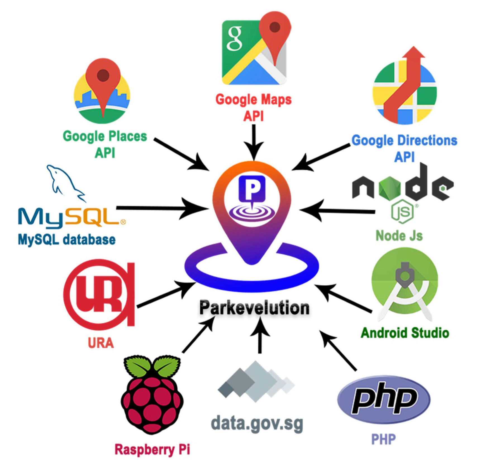

**DESCRIPTION &amp; IMPLEMENTATION OF**  **PARKEVELUTION&#39;S**  **FEATURES:**

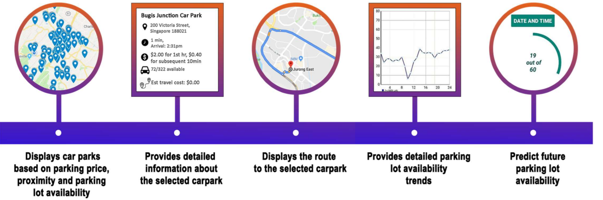

1. Mini-Map &amp; Search Bar:

In order to make the experience of using the app more user-friendly, we integrated google maps into our app with the help of the _Google Support Map Fragment_. We also implemented the _Google Places Autocomplete Search_ feature in our app to autocomplete the user&#39;s search queries as shown in the images below.

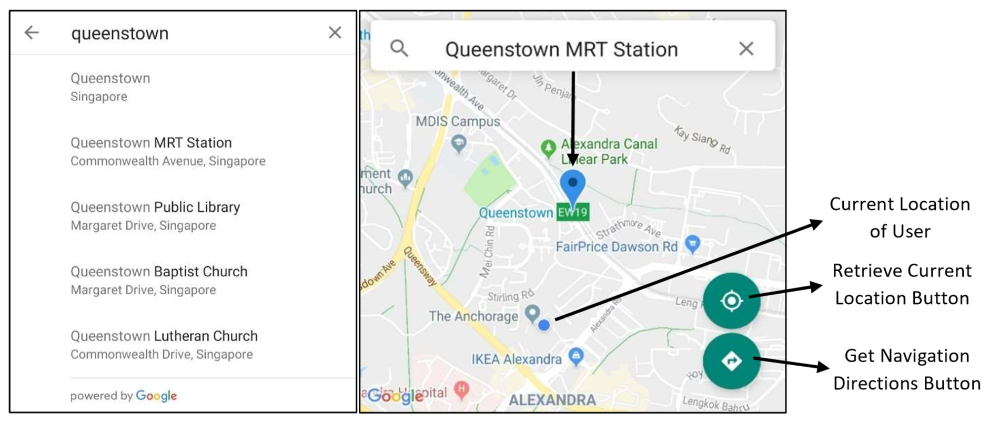

These features together help the users to quickly search for places they are interested in parking at and aid in making their parking experience hassle-free.

In order for the app&#39;s features to work, the user would have to provide the app with the required network and location permissions. Once the necessary permissions are provided, if the location service is on, the app will either use the _network location_ or _GPS location_ (whichever is more readily available, with priority given to GPS). In the case when the location service is not turned on, the user&#39;s current location is obtained using the android user&#39;s last known location feature. The_retrieve location_ button can be used in the case when the user wants to update his/her current location.

Once the user&#39;s current location is obtained, it is displayed as a blue dot on the mini-map as shown in the image above. In the case when the user decides to choose a location using the search bar, the selected location is zoomed in and focused upon before it shows up as a blue pin on the mini-map.

2. Proximity, Price, Availability &amp; Recommended Carparks Features:

The purpose of the proximity feature is to display the carparks which are in the closest vicinity of the user&#39;s current or selected location. Upon receiving the user&#39;s current or selected location, in order to simplify finding the distance of the carparks on the map, the Google Maps API is used to obtain the global latitude-longitude coordinates which are then converted to SVY21 x and y coordinates using the SVY21 converter method. The same method is used to convert the addresses of the carparks provided on [www.data.gov.sg](http://www.data.gov.sg/) to SVY21 x and y coordinates in run time. Following the conversions, the Pythagoras Theorem is used to compute the relative distance of each carpark from the selected location. The obtained relative map distances are then fed into a single array which is sorted to obtain the closest 50 carparks to the selected location. Once sorted, the actual distance from the selected location to the carpark is obtained using the Google Directions API and is displayed in a list format as seen in the image below.

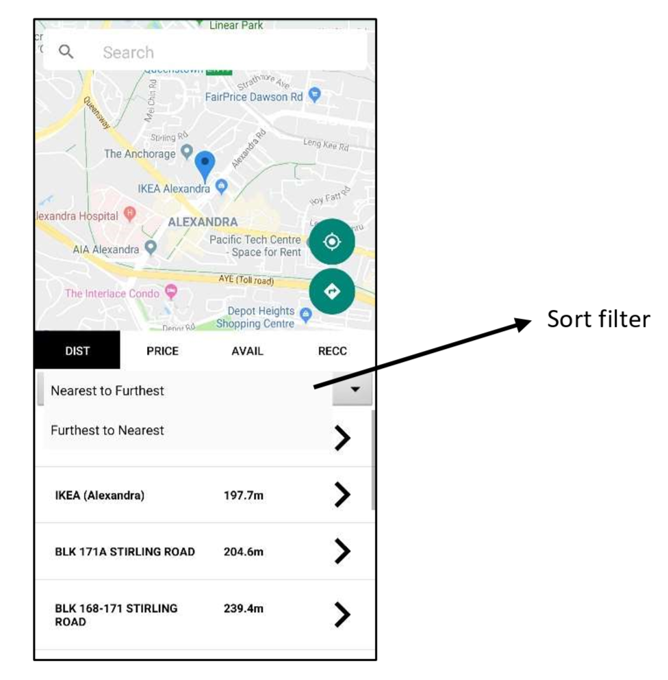

By default, the list of carparks is sorted from nearest to furthest. The user can choose to view the list sorted from the furthest to the nearest carparks by selecting the option from the sort filter as shown in the image above.

We obtained the pricing information of the HDB carparks from [www.hdb.gov.sg](https://www.hdb.gov.sg/cs/infoweb/car-parks/short-term-parking/short-term-parking-charges) while the pricing information for the rest of the carparks was obtained from [www.data.gov.sg](http://www.data.gov.sg/). The price feature which we implemented, enables the user to view the prices of the carparks in his/her vicinity in real-time.

Upon selection of the price tab, the app reads the detailed pricing information from the local database. Following this, the current date and time are obtained from the user&#39;s phone and this data is then used to obtain the real-time price of the carpark.

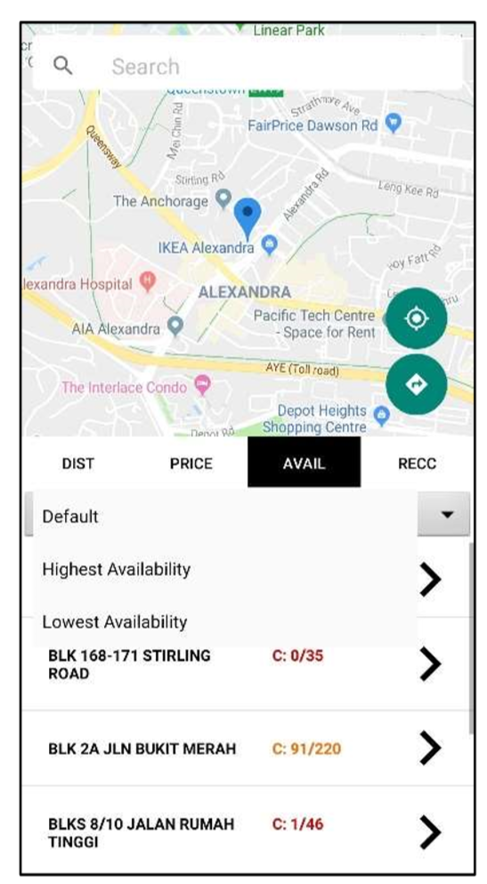

Once these prices are obtained, they are displayed in a list format sorted by distance by default. If the user wants to view the list sorted by price from cheapest to most expensive or vice-versa, he/she can choose the options from the sort filter as shown in the image above.

The availability feature comes in handy when users would like to know the real-time availability of carparks in their vicinity. In order to implement this feature, we used the availability API provided on [www.data.gov.sg](http://www.data.gov.sg/). A get request to this API provides the carpark availability data in JSON format.

Upon selection of the availability tab, the obtained JSON data is parsed to extract the carpark number and the carpark availability. The carpark numbers are used to uniquely identify the carparks in the local database following which the name of the carpark is obtained. In order to display the availability data in a more user-friendly manner, we categorised the data under low (\&lt;33%), medium (\&lt;67%) and high (\&gt;=67%) availability categories which are indicated by the colours red, yellow and green respectively.

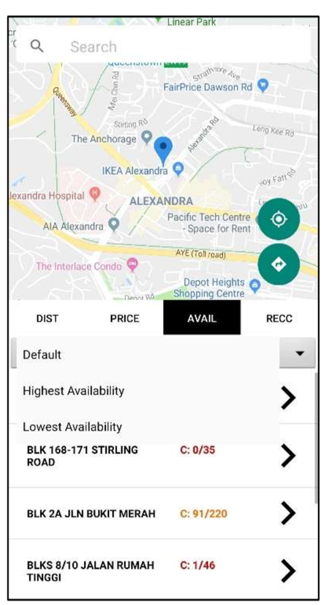

Once all the relevant information is obtained, it is then displayed in a list format sorted by distance by default. If the user wants to view the list sorted by lot availability from the carparks with highest availability first or vice-versa, he/she can choose the options from the sort filter as shown in the image above.

The unique selling point of _Parkevelution_ is that when the user is indecisive of choosing a carpark, there is a recommended carparks tab which factors in distance, price and availability to provide the user with the overall best carpark option.

Since there is no theoretically accurate way to recommend carparks, we conducted several experiments to come up with the most practical exponential function to optimise the recommendations by factoring in distance, price and availability which is as follows:

Index is a double value allocated to each of the 50 nearest carparks to the selected location. The lower the index value, the better the carpark. We decided to use 100m as a general threshold for distance as we observed that it resulted in the most optimal results. As seen from the function, when distance \&lt;= 100m, the distance has a considerably smaller effect on the index. On the contrary, when the distance \&gt; 100m from the current location, the index increases at a much faster rate with each unit increase in distance. We expressed the index as an exponential function of distance because most drivers give priority to distance to the carpark over the price of the carpark. As seen in the function, the index also considers the hourly parking price. With a higher parking rate, there would be a linear increase in index of the carpark, thus suggesting that it is less favourable and vice-versa. Since it is optimal to recommend carparks with a higher lot availability, we decided to express the carpark index as an inverse function of number of available lots so that higher availability would result in a lower index and vice-versa.

Upon selection of the recommended carparks tab, the list of the 50 nearest carparks is fed into a single array following which the index for each carpark is calculated using the function above. The calculated index is used to sort the carparks from the smallest to the largest index and the list of the sorted carparks is displayed as shown in the image below.

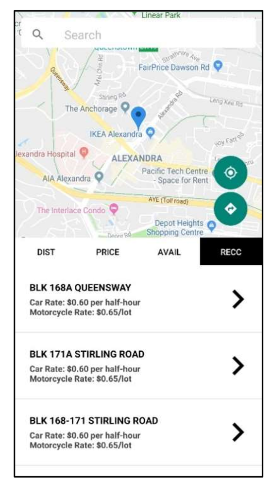

3. Detailed Information:

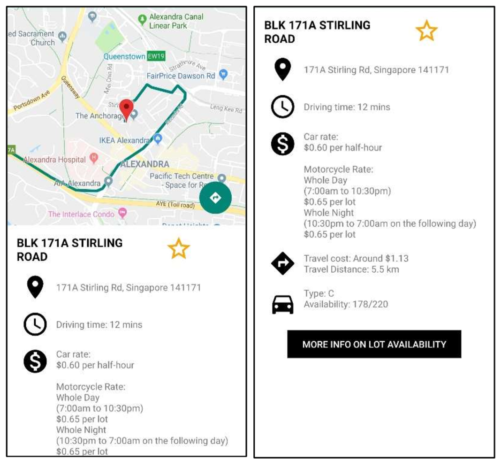

In order to view detailed information about a specific carpark, the user can press the arrow icon next to the name of the displayed carpark. Pressing the icon brings the user to a page where all the details relevant to the user are displayed as shown in the images above. While the _detailed pricing information_ is obtained from the local database and the _parking lot availability_ is obtained using the API provided on [www.data.gov.sg](http://www.data.gov.sg/), in order to display the _address_ and _estimated travel time_, the Geocoder class which is part of the Android location package was implemented. In addition, the _travel cost_ sub-feature was also implemented to accurately compute the petrol mileage of the user&#39;s vehicle required to cover the distance.

In order to provide the users with a deeper insight into the lot availability of the carpark, we needed a way to store the real-time availability data for future use. We accomplished this by using a Raspberry Pi as our personal server and by hosting a MySQL database on it. To store the real-time availability data from the API, upon retrieving it, the data is sent to the MySQL database on an hourly basis using a NodeJS application which runs on the Raspberry Pi 24/7.

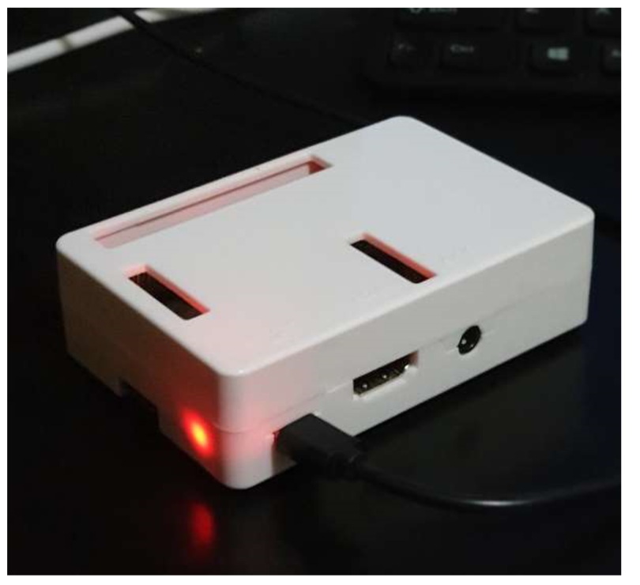

Upon pressing the _More Info on Lot Availability_ button, the app establishes a connection with the Raspberry Pi over the Internet and a PHP file hosted on the Raspberry Pi server helps to retrieve all the data from the MySQL database. In order to display the _parking lot availability over the past 24 hours_, we get the latest 24 rows added to the database and use that data to plot a graph as shown below.

The sub-feature that follows the plotted graph is the _prediction of lot availability_. In order for this feature to work, the user has to input a date and time in the future and press the _OK_ button. Upon doing so, the app uses an algorithm to analyse the trends in the availability data obtained from the database and displays the predicted parking lot availability in a user-friendly manner as shown below.

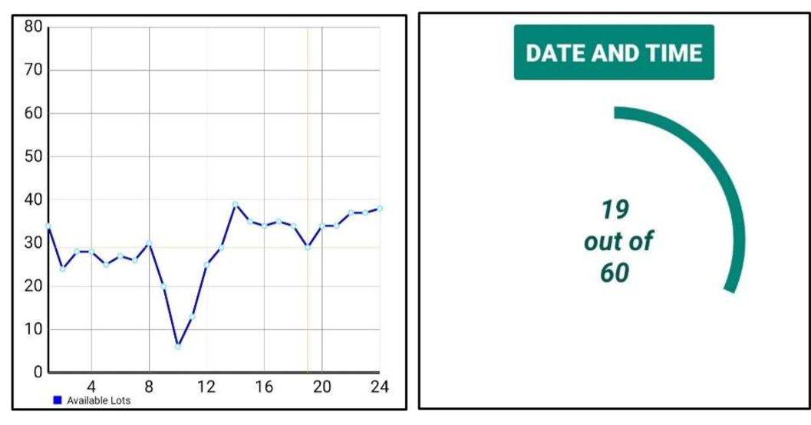

In the case when the user wants to view the navigation directions to the selected carpark, he/she can tap the navigation directions button on the bottom-right corner of the mini-map. Upon pressing this button, the app opens Google Maps with the starting point input as the current location of the user and the destination as the selected carpark as shown in the images below.

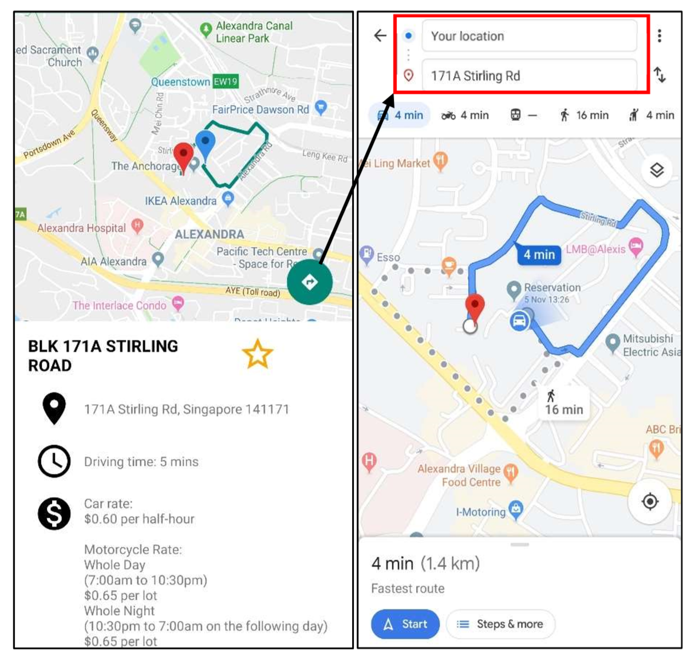

4. Sidebar:

It is often the case that the user forgets which carpark he/she parked in or if the user wants to save a particular carpark he/she is interested in. In order to bring forward the _Favourite Carparks_ and the _Park My Car_ features, we implemented a user-friendly sidebar. To display the sidebar in the app as shown in the image below, the user would have swipe right from the left edge of the screen.

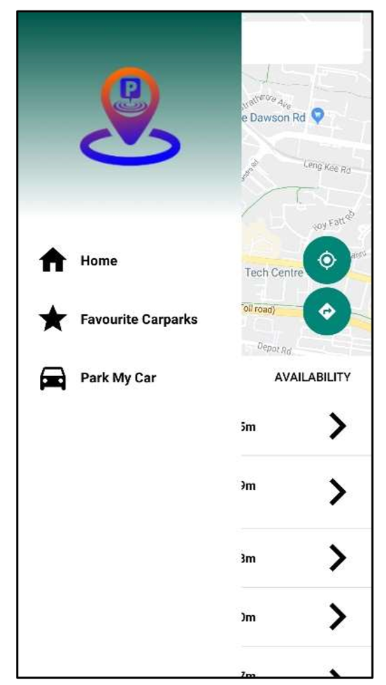

In order to store a particular carpark under the favourite carpark list, once the user selects a particular carpark, he/she can press the yellow star icon next to the name of the carpark to add to it to their favourite carparks. Once the carpark is saved, the user can view in the list displayed upon selecting the _Favourite Carparks_ option from the sidebar. In order to remove the carpark from this list, the user can press the yellow star icon once again.

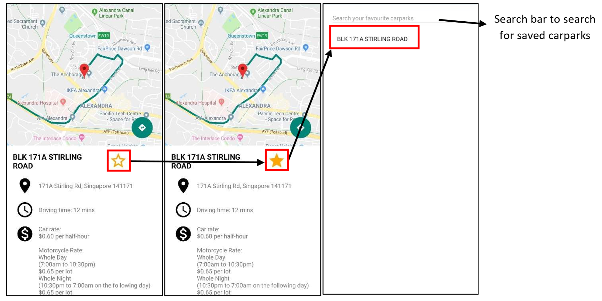

In the case when the user does not want to explicitly remember where he/she parked the car, the user can use the _Park My Car_feature. Upon selection of this sub-feature from the sidebar, the app opens up a screen to display the current location with a textbox to enter some description and finally a button which says _Park Here_. Pressing this button, causes the app to store the user&#39;s current location and a red pin is dropped in the mini-map as displayed in the image below.

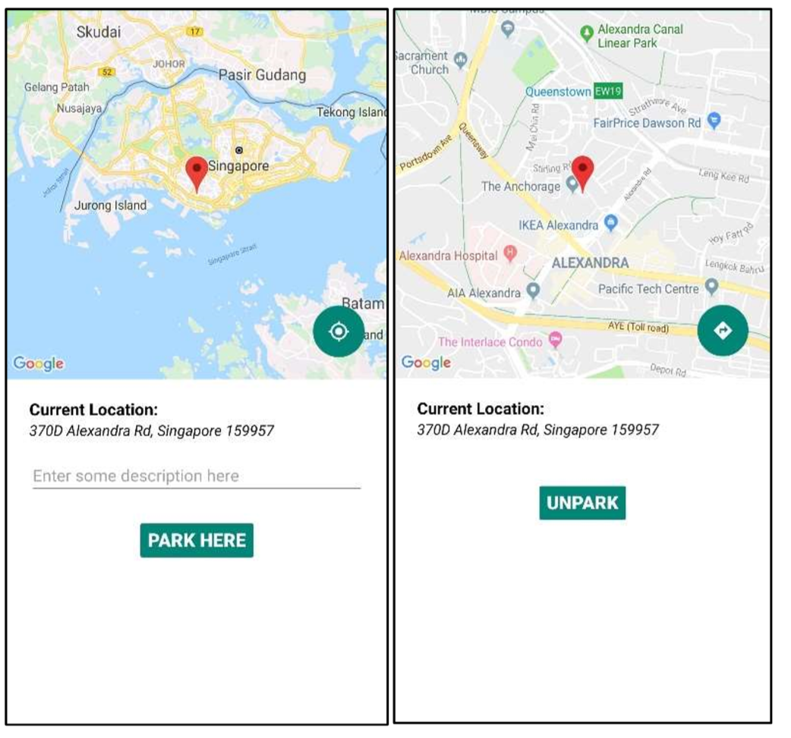

When the user wants to find where he/she parked the car, he/she can select the _Find My Car_ option from the sidebar. This opens up a page where the user can see the saved location of his/her car on the mini-map. Once the user finds the car, he/she can select the _Unpark_ button which causes the app to forget the stored location.

**COMPARISION WITH OTHER SIMILAR APPS:**

_Carpark Rates_ by sgCarMart

- Unlike _Carpark Rates_, _Parkevelution_ conveniently consolidates all the relevant data and displays it in the list of carparks either sorted by proximity, price or availability.
- The feature that makes _Parkevelution_ unique is that it has a recommended carparks feature which factors in price, distance and availability to provide the user with the best carpark option unlike any parking app in the Singaporean market.
- Apart from optimizing the search for carparks, unlike _Carpark Rates_, _Parkevelution_ has facilities to provide navigation directions to the selected carpark, calculate the travel cost in route to the destination, display parking lot availability over the past 24 hours in a graphical format, predict future parking lot availability and many other additional features.
- In summary, apart from enhancing all the basic features prevalent in _Carpark Rates_, _Parkevelution_ provides several other unique and useful features making it a rather well-rounded android application.

**LIMITATIONS:**

1. Lack of a Carpark Payment Feature:

In the initial stages of development, we planned to implement the payment for carparks feature just like in the _Parking.sg_ app by Government Technology Agency. However, after extensive research, we realized that there was no publicly available API which allowed us to do so. We are sure that in the case it was publicly available, integrating this feature into our app would have made _Parkevelution_ the one app meeting all the parking requirements of users.

2. Lack of Parking Lot Availability Data for Malls and Some HDB Carparks:

As mentioned earlier, the real-time availability data for the carparks is retrieved from an API provided on [www.data.gov.sg](http://www.data.gov.sg). However, this API only provides the real-time lot availability for most HDB carparks while the API for the real-time lot availability for the carparks in malls and some HDBs is not publicly available. Hence, we were unable to implement the availability feature for the carparks in malls and some of the HDBs.

3. Speed Constraint of Raspberry Pi Server:

In order to be cost-effective, we decided to make a Raspberry Pi our own personal server instead of using one of the paid web hosts online. However, this decision came with its own implications.

For the app to function as per normal, the Raspberry Pi has to be left running 24/7 because of which at times it can run into some unusual problems and the server goes down. Other than this, we observed that a Raspberry Pi as a server is very slow and that the data took more than ten seconds to be retrieved from the MySQL database hosted on it. But since _Parkevelution_ is not a commercial app and is just a prototype, we decided to continue using the Raspberry Pi instead of switching over to a more powerful server.

4. Inaccuracy of the _Predict Lot Availability_ Feature in Initial Stages:

As mentioned earlier, the algorithm we used predicts the future lot availability based on trends in the Raspberry Pi&#39;s MySQL database. However, if there is not enough data then the prediction algorithm may not be so accurate. In order to overcome this, more real-time lot availability data was collected and stored in the database by the Raspberry Pi over the course of two months. Though this feature may not be 100 per cent accurate all the time due to the randomness of parking lot availability in the real world, with more data in the database, came more accuracy in the lot availability prediction.

**TESTING PHASES:**

Though it was challenging to learn new things and implement _Parkevelution&#39;s_ features, in order to ensure the success and sanity of our app development process, we had to carry out comprehensive testing. In order to do so, we implemented three phases of testing as listed below.

1. Testing on Emulators in Android Studio:

Since we required a method to test our android application on a variety of devices, we decided to use the emulators in Android Studio. We interacted with the emulator manually through its graphical interface and programmatically through the terminal and emulator console. By doing so, we encountered several sorts of unusual behaviour from the app. In order to narrow down the causes of such behaviour, we used multiple print statements in the code for debugging purposes. All the major bugs we encountered and fixed in this process have been listed in the table below:

| **Bug Summary** | **Bug Solution** |
| --- | --- |
| Mini-map and the list of carparks did not auto update when the user entered a search query. | We implemented an event listener to detect retrieval of the longitude and latitude of the selected location. On success, the adapter for the viewpager for the tab views is notified and refreshed. |
| App crashed when the location service was switched off or if the network suddenly went down. | To prevent the app from crashing when location service was off, we provided a default location (Singapore&#39;s Central Coordinates = _1.2906, 103.853_). This allows the user to continue using our app with their location service disabled however some of the app&#39;s functionalities would be compromised as a result. |
| App was not able to fetch real-time prices of the carpark under the &quot;Price&quot; tab. | We made major changes to the local database and also fixed the data parsing algorithm. |
| App crashed when the &quot;More Info on Lot Availability&quot; button was pressed multiple times. | We provided the app with a larger memory heap. |
| Data saved from the &quot;Park My Car&quot; feature was lost upon exiting the app. | We used SharedPreferences to provide the app with persistent memory. |
| App crashed when an HTTP request was initiated and the user pressed the back button. | Upon initiation of an HTTP request, the request was performed asynchronously using AsyncTask accomplished with the help of the Android Volley library. However, when the user pressed the back button in the process, the app crashed after a while as once the AsyncTask was completed, it tried to find the missing views to place the information in. After having realized this, we handled this bug by checking if a View was present before letting the AsyncTask display information on it. If the view is null, then nothing is done thus avoiding the NullPointerException. |

Once all the bugs were squashed, we had to make sure that all the functionalities worked as expected under different conditions. In order to achieve this, we conducted highly focused tests of each feature by simulating various user inputs multiple times. The results we achieved from these tests have been listed in the table below:

| **Key** | **Feature** | **Result** |
| --- | --- | --- |
| 1 | Check the functionality of the _retrieve current location_ button | Passed |
| 2 | Check the functionality of the _navigation directions_ button | Passed |
| 3 | Check whether the list of carparks displayed under the proximity, price and availability tabs are sorted by distance | Passed |
| 4 | Check the functionalities of the proximity, price and availability tabs | Passed |
| 5 | Check if the mini-map and the list of carparks auto update upon entering a search query | Passed  |
| 6 | Check if all the components of the _detailed information_ page load properly | Passed |
| 7 | Check if the mini-map auto zooms out so that the rough route to the carpark is visible in the _detailed information_ page | Passed  |
| 8 | Check if the _More Info on Lot Availability_ button loads the 24-hour parking lot availability data and if the _prediction of lot availability_ functionality is working | Passed  |
| 9 | Check if the _favourite carparks_ feature is working | Passed |
| 10 | Check if the _park my car_ feature is working | Passed |

The one downside to using emulators was that we could not effectively test the natural touch gestures which was why we moved on to the next phase of testing at this point.

2. Alpha Testing:

After testing the app on the emulators, we had to make sure that the app not only worked on a real device but also under real-life scenarios. Instead of simulating the user data as we did in the previous phase, in order to make it as realistic as possible, we used the app on a daily basis for a week to optimize our own parking experience.

In order to cross-verify the functionalities of the proximity, price and availability features, we compared the obtained data to that found on the _Carpark Rates_ app. We observed that the other basic features like the _Favourite Carparks_ and _Park My Car_ also worked as expected.

However, in order to test the accuracy of the more complex feature _Predict Lot Availability_, we had to conduct a real-life test. The idea of the test was to predict the lot availability of a selected carpark for the following day and to cross-check that the predicted lot availability was close to the actual lot availability. To conduct the test, we selected the date for the following day and selected the time **10:20pm**. As shown in the following images, our app predicted that the lot availability at that time would be **6/104**.

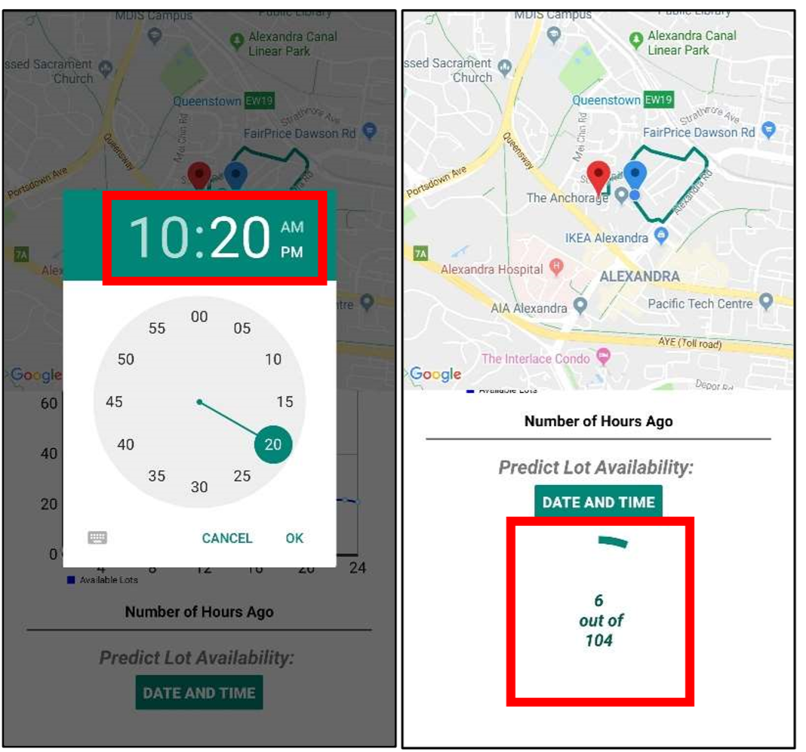

On the following day, we checked the lot availability of the selected carpark through our app as well as in-person to double-check and we observed that the actual lot availability was **11/104** as shown below.

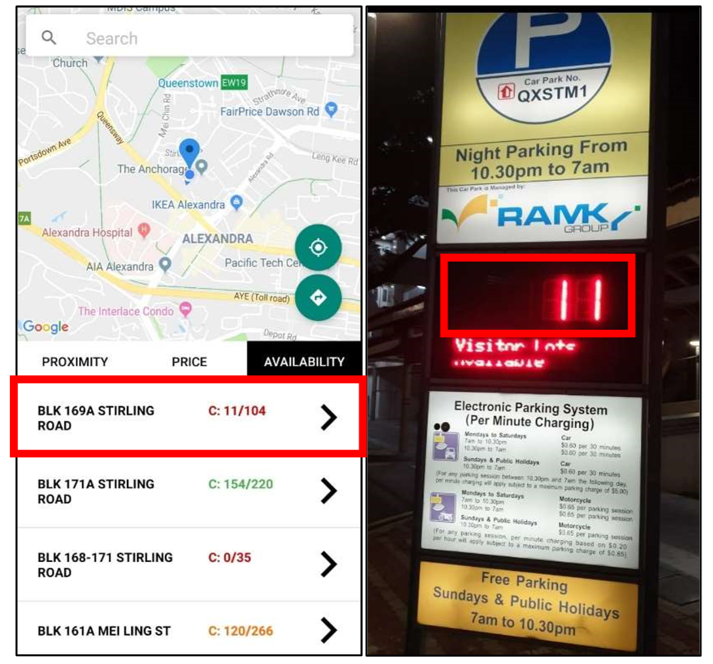

The fact that the predicted value was so close to the actual value proved to us that this feature was also working as expected. The successful outcomes of testing out all the app&#39;s features over the course of a week brought a conclusion to this phase of testing.

3. Beta Testing with Other Users:

After testing the app on our own, in order to make sure that our app was free of bugs as well as to see whether it would be well-received, we implemented this testing phase. In this phase, we sent out the APK of our application to 9 friends of ours and let them use it for a couple of days before they provided us with their feedback.

In order to get back constructive feedback from our friends, we send out a few questions via Google Forms. The survey feedback we received can be seen in the images below.

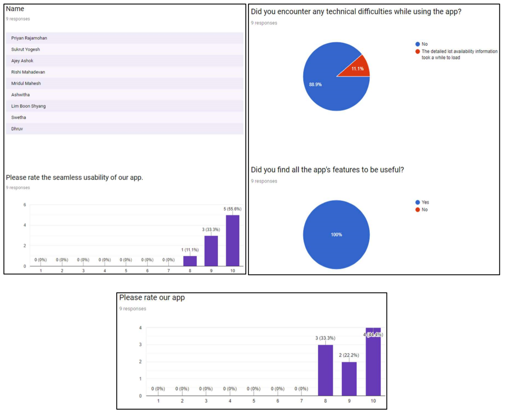

Upon receiving the feedback, we were glad that none of the users complained about any bugs and that all the app&#39;s features were well-received. This brought an end to this phase of testing.

**CONCLUSION:**

It is hard to disagree with the fact that people love mobile applications because without them our life would be so much more inconvenient. However, going through the process of developing such an app is a completely different experience.

In the context of Orbital, we loved the fact that we were given the freedom to make any project we wanted and to implement any additional features which came to our mind. This opened up a huge range of possibilities and as a result, we were able to create unique and useful features. Over the course of the past three months developing our app, we faced both minor as well as major bugs and made numerous frustrating attempts at debugging faulty code. However, overcoming these hurdles gave us a deeper understanding of how various software packages and tools can be engineered together to create product mobile apps like _Parkevelution_. All in all, we are glad to have gone through such an enriching three months of learning and to have simultaneously a created a close-to-perfect one-stop solution to the parking problems of Singaporean users in the process.

**ACKNOWLEDGEMENTS:**

The following third-party libraries were used in the development of _Parkevelution_:

1. _com.github.loicteillard:EasyTabs:0.4_

- Used to implement the sliding tab view for Proximity, Price and Availability

2. _com.android.volley:volley:1.1.0_

- Used to make HTTP requests to the availability API and our Raspberry Pi server to retrieve data

3. _com.google.android.gms:play-services-maps:16.1.0_

- Used to display the mini-map fragment in our app

4. _com.google.android.libraries.places:places:1.1.0_

- Used to get the name of places from their latitude and longitude information
- Used to implement the autocomplete text search bar

5. _com.akexorcist:googledirectionlibrary:1.0.4_

- Used to display the rough route from the user&#39;s current location to the user&#39;s selected carpark in the mini-map

6. _com.mxn.soul:flowingdrawer-core:2.1.0_

- Used to implement the sidebar navigation drawer for the app to allow users to navigate among the different interfaces (_Home_, _Favourite Carpark_s, _Park My Car/Find My Car_).

7. _com.github.PhilJay:MPAndroidChart:v3.1.0-alpha_:

- Used to display the latest 24-hour availability data in a graphical format.
